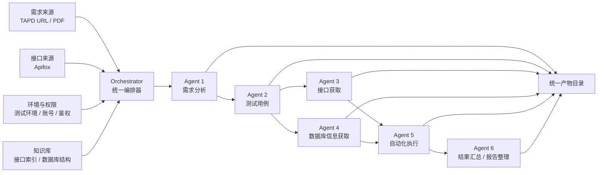

# AI 测试框架整体方案

## 一、建设背景与目标

### 1.1 建设背景
当前测试工作仍存在较多重复性人工操作，典型问题包括：需求理解依赖个人经验、测试点与测试用例产出效率不稳定、接口定位高度依赖人工检索、自动化前置准备成本高、执行结果与需求之间缺少统一追溯链路，导致整体测试效率、覆盖率和复盘质量仍有提升空间。

结合现有测试实践，我们正在建设一套面向需求到报告全链路的 AI 测试框架，主链路为：

```text
需求输入 -> 需求分析 -> 测试点/测试用例生成 -> 接口获取 -> 数据库信息获取 -> 自动化执行 -> 报告输出
```

该框架的目标不是“用 AI 替代测试人员”，而是把大量重复、机械、格式转换型工作交给 AI Agent，把测试人员的精力释放到需求判断、风险识别、策略设计和质量决策上。

### 1.2 整体目标
本框架的整体目标可以概括为四句话：

- 把测试流程从“人驱动”升级为“流程驱动 + Agent 协同”。
- 把测试资产从“分散输出”升级为“结构化沉淀 + 统一归档”。
- 把测试执行从“局部自动化”升级为“可编排、可追溯、可复用的工程化链路”。
- 把测试结果从“技术视角输出”升级为“面向管理、研发、测试多角色可读的统一报告”。

### 1.3 需要解决的核心问题
- 需求理解不统一，导致测试设计质量波动。
- 测试点和测试用例产出依赖人工经验，效率和覆盖度受限。
- 接口文档检索与确认成本高，接口映射效率低。
- 数据库结构定位困难，自动化前置分析成本高。
- 自动化执行前缺少标准化输入，脚本生成和执行难以规模化复制。
- 执行结果分散在聊天记录、临时文件和零散日志中，难以复盘和追溯。

### 1.4 为什么采用多 Agent，而不是单一 Agent
采用多 Agent 分工，而不是单一 Agent，一方面是为了提升专业性，另一方面是为了保证流程稳定性。

- 单一 Agent 容易把需求理解、测试设计、接口定位、数据判断和自动化执行混在一起，职责边界不清，结果不可控。
- 多 Agent 能将复杂流程拆解为若干标准化阶段，每个阶段只解决一类问题，便于质量控制。
- 多 Agent 便于建立阶段输入输出契约，使每一步都可解释、可审核、可复用。
- 多 Agent 更适合后续扩展，例如新增 TAPD 接入、更多接口平台、更多知识库来源或更多自动化执行能力时，不需要整体推翻重做。

### 1.4.1 Agent 职责声明与职责冻结
每个 Agent 开始执行前，必须先声明自己的角色定位、输入范围、输出范围、禁止事项和进入下一阶段条件。这是强制步骤，不能省略。

所有 Agent 必须按既定职责执行，不能随意更改职责、越权执行下游任务或把未完成的职责交给下一阶段。例如：Agent 3 不能只输出接口路径就交给 Agent 4；Agent 4 不能跳过 Excel 输入模板、接口契约校验或执行前置检查。

如果发现某个 Agent 的产物与职责不一致，流程必须停住，先输出职责偏差说明和修正计划，再补齐该 Agent 的缺失职责。

### 1.5 核心价值
- 对业务的价值：更快支撑需求验证，提高测试响应速度。
- 对管理的价值：形成标准流程、统一输出、可量化推进。
- 对团队的价值：沉淀可复制能力，降低对个人经验的过度依赖。
- 对质量的价值：建立需求到执行结果的完整追溯链路，提升测试覆盖和复盘效率。

## 二、整体框架设计

### 2.1 总体设计思路
整体框架采用“统一编排器 + 多 Agent 协作 + 知识库支撑 + 标准化产物归档 + 统一报告输出”的设计方式。



其中，从当前工程实现来看，接口获取和数据库信息获取主要由“接口与数据结构上下文获取能力”统一支撑；从汇报展示视角，可拆分为两个能力 Agent 进行说明，以便领导更清晰理解链路分工。

### 2.2 整体链路如何流转
整体链路按照“先结构化、再自动化、最后汇总输出”的原则流转。

1. 先把原始需求转化为结构化需求模型。
2. 再把结构化需求转化为测试点与测试用例集合。
3. 再根据测试意图去定位真实接口和相关数据库结构。
4. 在接口、结构、环境与鉴权条件满足后，再进入自动化执行阶段。
5. 最后将执行结果、证据链和追溯关系统一汇总为 Markdown 报告与 Allure 报告。

这样设计的核心原因是：如果没有结构化过程，后续自动化只能建立在模糊理解和不完整上下文之上，结果既不稳定，也不可复用。

### 2.3 各阶段输入输出关系

| 阶段 | 主要输入 | 主要输出 | 作用 |
|---|---|---|---|
| 需求分析 | TAPD URL、PDF、附件、图片 | 结构化需求模型、风险点、待确认项 | 建立统一需求事实基础 |
| 测试用例生成 | 结构化需求模型 | 测试点、测试用例、自动化候选清单 | 把业务目标转为可验证内容 |
| 接口获取 | 测试用例、知识库索引、Apifox 信息 | 接口目录、接口详情、接口映射关系 | 明确“测什么接口、怎么调接口” |
| 数据库信息获取 | 测试用例、知识库中的数据库结构 | 表结构目录、字段说明、数据映射建议 | 明确“涉及哪些表结构、怎么验证数据状态” |
| 自动化执行 | 测试用例、接口详情、表结构、环境配置、Excel 输入模板 | 自动化脚本、执行日志、Allure 原始结果、执行报告 | 完成自动化验证闭环 |
| 结果汇总 | 所有阶段产物 | 统一 Markdown 汇总、追溯报告、管理视角摘要 | 支撑复盘、汇报和复用 |

### 2.4 知识库在整个流程中的作用
知识库是本框架的关键基础设施，承担三个作用：

- 定位作用：帮助 Agent 快速缩小接口与数据库检索范围，提高匹配效率。
- 复用作用：将以往已整理的接口索引、表结构、变更记录沉淀下来，减少重复劳动。
- 风控作用：通过“已有结构化知识”与“实时获取详情”的配合，降低 AI 凭空假设的风险。

知识库不是最终事实来源的唯一渠道，而是“高效定位器”和“结构化沉淀层”。例如接口能力中，知识库先用于定位候选接口，再通过 Apifox 令牌获取接口详细定义，保证最终输入来源真实可靠。

### 2.5 关键平台和资产的定位

| 组件 | 在框架中的定位 |
|---|---|
| TAPD | 需求来源之一，支持通过 URL 获取需求内容 |
| PDF | 需求来源之一，支持解析文档、图片和页面截图 |
| Apifox | 当前统一的接口事实来源，用于获取接口详细定义 |
| 数据库知识库 | 数据结构来源，只提供表结构与字段信息，不提供业务数据 |
| Excel 模板 | 自动化执行阶段的标准输入载体，用于补充环境、鉴权、账号、执行约束等信息 |
| Allure 报告 | 自动化执行结果的可视化报告载体，面向结果查看、证据展示和问题定位 |
| Markdown 汇总文档 | 全链路统一汇总载体，面向管理层、项目组和复盘归档 |

### 2.6 为什么该方案具备可落地性
当前方案具备可落地性，主要基于以下几点：

- 已经形成明确的主链路设计，不是停留在概念阶段。
- 已有需求分析、测试用例、接口获取、自动化执行等核心能力原型。
- 已有本地知识库目录、Schema 约束、运行目录规范和产物归档机制。
- 已验证 Apifox 接口获取、PDF 需求分析、Allure 报告输出等关键能力。
- 当前设计强调阶段性阻断机制，在信息不足时不强行推进，可控性较强。

## 三、整体实现方案

### 3.1 总体架构设计
从实现角度看，当前方案由五层组成：

1. 输入层：接收 TAPD、PDF、Apifox、环境信息、Excel 模板等外部输入。
2. Agent 处理层：按职责执行需求分析、测试设计、接口获取、数据库结构获取、自动化执行和结果整理。
3. 知识支撑层：提供接口索引、数据库结构、Schema 约束、历史同步结果等支撑能力。
4. 编排与控制层：由 Orchestrator 负责阶段调度、输入输出交接、质量门禁和统一归档。
5. 输出层：生成 Markdown 汇总文档、Allure 报告、执行报告、追溯清单和归档目录。

### 3.2 “先结构化，再自动化，再汇总输出”的落地方式
这一原则是整套框架的核心工程化方法：

- 先结构化：先把需求、测试用例、接口信息、数据库结构全部转为标准化、可消费的结构化产物。
- 再自动化：只有在输入完整、映射清晰、环境满足时才启动自动化脚本生成与执行。
- 再汇总输出：所有执行过程和结果最终统一沉淀到标准报告和归档目录，形成可复盘的证据链。

这一方式可以显著降低“AI 直接生成脚本但缺少事实依据”的风险，使自动化建立在可验证上下文之上。

### 3.3 当前方案的工程化特征
- 每次需求处理都生成独立运行目录，避免不同任务相互污染。
- 每个 Agent 都有独立输入、输出、日志和状态文件。
- 关键结构化产物有 Schema 约束，降低格式漂移和上下游理解偏差。
- 报告输出不是单一日志，而是同时包含管理视图、技术视图和追溯视图。

### 3.4 统一归档机制
统一归档是工程落地的重要抓手。每次执行形成独立目录，典型结构如下：

```text
workspace/
  runs/
    <run_id>/
      requirement_agent/
      testcase_agent/
      interface_context_agent/
      automation_agent/
      reports/
      record_index.md
```

其意义在于：

- 方便追溯每次需求的完整处理过程。
- 便于复盘哪一步输出了什么结果、出现了什么阻塞。
- 便于后续复用已有产物，形成知识沉淀。
- 便于面向管理层做阶段性汇报和成果展示。

## 四、各 Agent 职责说明

### 4.1 需求分析 Agent

#### Agent 定位
需求分析 Agent 是全链路入口 Agent，负责把原始需求材料转化为结构化、可测试、可追溯的需求模型。

#### 负责解决什么问题
- 原始需求表达形式不统一。
- 需求正文、图片、附件、评论等信息分散。
- 需求中存在歧义、缺失、冲突，后续阶段难以直接消费。

#### 核心职责
- 解析 TAPD URL 或 PDF 需求文档。
- 提取需求目标、业务背景、角色、主流程、规则、异常场景和验收关注点。
- 识别需求缺失项、歧义点、待确认点和潜在风险。
- 输出结构化需求模型，作为后续测试设计依据。

#### 输入来源
- TAPD URL。
- PDF 需求文档。
- 附件、截图、原型图、流程图等补充信息。

#### 输出结果
- `requirement_model.json`
- 需求分析说明文档
- 风险点与待确认项列表
- PDF 解析快照与文本抽取结果

#### 与上下游 Agent 的关系
- 上游是需求来源。
- 下游是测试用例 Agent。
- 它的输出是全流程的事实基础。

#### 不负责什么
- 不生成测试用例。
- 不查接口。
- 不查数据库。
- 不生成自动化脚本。

#### 为什么不能省略
如果没有这一层，后续所有测试设计都将建立在非结构化需求之上，容易导致测试点偏差、遗漏和不可追溯。

#### 当前阶段落地方式
当前已支持 TAPD URL 和 PDF 两类需求来源，并能输出结构化分析结果；对于信息不完整的需求，支持输出阻塞点，而不是强行进入下游阶段。

### 4.2 测试用例 Agent

#### Agent 定位
测试用例 Agent 是测试设计中心，负责将结构化需求转化为测试点、测试用例和自动化候选集合。

#### 负责解决什么问题
- 需求到测试用例之间高度依赖人工转换。
- 用例覆盖范围容易受经验差异影响。
- 自动化候选缺少前置筛选。

#### 核心职责
- 生成测试点和测试用例。
- 覆盖主流程、异常流程、边界条件、权限与数据一致性场景。
- 标记优先级和自动化候选状态。
- 建立需求点与测试用例之间的追溯关系。

#### 输入来源
- 需求分析 Agent 输出的结构化需求模型。
- 风险点、验收点和待确认项。

#### 输出结果
- `test_points.json`
- `test_cases.json`
- `test_cases.md`
- 覆盖说明或覆盖缺口报告

#### 与上下游 Agent 的关系
- 上游是需求分析 Agent。
- 下游是接口获取 Agent 和数据库信息获取 Agent。
- 它决定了后续要找哪些接口、关注哪些数据结构。

#### 不负责什么
- 不假设接口存在。
- 不直接访问 Apifox。
- 不生成自动化脚本。

#### 为什么不能省略
如果直接从需求跳到接口或自动化，容易产生“有脚本、无测试意图”的问题，无法说明为什么测、测了什么、覆盖了哪些风险。

#### 当前阶段落地方式
当前已具备用例结构化生成能力，并可标记自动化候选用例，为后续自动化执行提供明确输入。

### 4.3 接口获取 Agent

#### Agent 定位
接口获取 Agent 负责为测试用例找到真实接口定义，解决“测哪个接口、接口怎么调、需要哪些字段和鉴权”的问题。

#### 负责解决什么问题
- 接口定位依赖人工搜索，效率低。
- 测试意图与接口定义之间缺少映射。
- 接口文档不完整时，下游执行难以继续。

#### 核心职责
- 根据测试用例从知识库定位候选接口。
- 以需求业务动作、状态流转、查询回显点、结果验证点和依赖关系为边界，自主扩展并确认完整接口链路，而不是只围绕研发报告或需求文档中显式出现的接口。
- 基于项目、分组或接口线索，从 Apifox 获取接口详细定义。
- 除主写接口外，还要补齐详情或回显接口、列表查询接口、状态变更接口以及影响自动化判断的关键关联接口。
- 输出请求方式、路径、参数、请求体、响应体、鉴权方式等信息。
- 建立测试用例与接口之间的映射关系。
- 标记缺失接口、缺失字段和低置信度映射。

#### 输入来源
- 测试用例 Agent 输出的 `test_cases.json`
- 知识库中的接口索引
- Apifox 项目、分组或接口来源信息

#### 输出结果
- 接口目录
- 接口详细定义
- 接口映射清单
- 缺失接口报告

#### 与上下游 Agent 的关系
- 上游是测试用例 Agent。
- 下游是自动化执行 Agent。
- 它为自动化执行提供真实接口上下文。

#### 不负责什么
- 不编写最终业务测试脚本。
- 不保存明文 token。
- 不凭空补齐接口信息。

#### 为什么不能省略
如果没有该 Agent，自动化执行阶段只能凭测试语义猜接口，准确性和可执行性都会显著下降。

#### 当前阶段落地方式
当前方案已支持“先由知识库定位候选接口，再通过个人令牌从 Apifox 拉取接口详细定义”的方式，保证兼顾效率与真实性。
这里的“候选接口”仅是缩小检索范围的起点，不是 Agent 3 的职责边界上限。Agent 3 必须继续依据需求补齐关联接口链路，直到形成可供自动化消费的完整接口全景。

### 4.4 数据库信息获取 Agent

#### Agent 定位
数据库信息获取 Agent 负责提供自动化所需的数据结构上下文，帮助判断涉及哪些表、字段和状态验证点。

#### 负责解决什么问题
- 业务场景常需要依赖数据库结构理解数据关系。
- 自动化前需要知道如何造数、查数或验证状态。
- 直接读取业务数据风险高，不适合纳入标准流程。

#### 核心职责
- 从知识库中提取相关库、表、字段、索引和说明。
- 建立测试用例与数据库结构之间的映射关系。
- 输出造数提示、验证提示和缺失结构说明。
- 明确哪些结构已确认，哪些仅为待确认项。

#### 输入来源
- 测试用例
- 知识库中的数据库结构文件
- 业务域范围信息

#### 输出结果
- 数据库结构目录
- 表结构说明文档
- 数据映射建议
- 缺失数据库结构报告

#### 与上下游 Agent 的关系
- 上游是测试用例 Agent。
- 下游是自动化执行 Agent。
- 它与接口获取 Agent 一起构成自动化执行的上下文基础。

#### 不负责什么
- 不读取业务数据。
- 不导出真实记录。
- 不直接操作生产或真实业务库。

#### 为什么不能省略
接口能回答“怎么调”，数据库结构能回答“怎么验证”和“数据状态可能在哪里体现”。缺少这一层，自动化对复杂业务场景的支撑能力会明显不足。

#### 当前阶段落地方式
当前以知识库方式沉淀数据库结构，只提取表结构，不提取业务数据，兼顾可用性与安全性。从工程实现上，该能力当前主要归属于 Agent 3 的数据结构上下文子能力。

### 4.5 自动化执行 Agent

#### Agent 定位
自动化执行 Agent 是执行闭环 Agent，负责基于标准输入生成、执行和管理接口自动化测试。

#### 负责解决什么问题
- 自动化脚本生成依赖人工拼装上下文。
- 环境、鉴权、数据、断言常常分散在不同位置。
- 执行结果缺少统一输出。

#### 核心职责
- 评估是否具备自动化执行条件。
- 基于接口定义、数据库结构和测试用例生成自动化脚本。
- 按标准化输入执行测试。
- 输出执行日志、失败分类、执行报告和 Allure 结果。

#### 输入来源
- 测试用例
- 接口详细定义
- 数据库结构上下文
- Excel 输入模板
- 环境配置、账号信息、鉴权规则

#### 输出结果
- 自动化计划
- 自动化脚本
- 执行日志
- 执行报告
- Allure 原始结果和 HTML 报告

#### 与上下游 Agent 的关系
- 上游是接口获取 Agent 和数据库信息获取 Agent。
- 下游是结果汇总 Agent。
- 它是从“分析阶段”进入“验证阶段”的关键节点。

#### 不负责什么
- 不重新定义需求。
- 不绕过上游映射强行执行。
- 不在环境、鉴权或数据不足时伪造结果。

#### 为什么不能省略
没有自动化执行 Agent，前面的结构化分析只能形成文档资产，无法真正形成可复用、可规模化的自动化能力闭环。

#### 当前阶段落地方式
当前已支持基于标准输入生成 pytest 风格脚本并输出 Allure 报告，且已提供 Agent 4 Excel 输入模板，用于规范补充执行所需关键信息。

Agent 4 的入口必须以 Excel 输入模板为准。到达自动化执行阶段后，系统应先提示用户填写模板，并等待用户确认；如果用户直接上传了 Excel 模板文件，Agent 4 不校验文件名，直接按用户上传的文件读取和分析；如果用户未上传模板，Agent 4 必须自行到统一路径 `workspace/templates/Agent4自动化执行输入模板_鉴权约束修正版.xlsx` 查找通用模板，此时才要求模板名称必须保持为 `Agent4自动化执行输入模板_鉴权约束修正版.xlsx`。如果统一路径下的模板被改名或不存在，Agent 4 必须提醒用户名称或路径不符合规范并停住。只有完成模板读取、必填项校验、敏感字段脱敏检查，并确认环境、鉴权、数据操作权限和执行边界后，才允许生成脚本或执行接口请求。不能跳过模板提示，不能复制运行目录内的模板副本替代统一路径，不能用历史运行中的账号、环境、token 或默认值代替本次用户确认。

### 4.6 结果汇总 / 报告整理 Agent

#### Agent 定位
结果汇总 Agent 负责将分散在各阶段的结构化产物、执行结果和证据链整理为统一汇报材料。

#### 负责解决什么问题
- 执行结果分散在日志、JSON、脚本和临时目录中。
- 管理层更关注结论、风险、覆盖和价值，而不是原始执行细节。
- 缺少统一汇总文档时，复盘和复用成本高。

#### 核心职责
- 汇总需求、用例、接口、数据库、执行结果和失败原因。
- 输出统一 Markdown 汇总文档。
- 形成需求到结果的追溯关系说明。
- 沉淀最终归档索引，支撑后续复盘和复用。

#### 输入来源
- 所有 Agent 的结构化产物
- 自动化执行结果
- Allure 报告摘要

#### 输出结果
- 统一 Markdown 汇总文档
- 追溯报告
- 最终总结说明
- 归档索引文档

#### 与上下游 Agent 的关系
- 上游是所有执行和分析 Agent。
- 下游是管理层、项目组、复盘场景和知识沉淀场景。

#### 不负责什么
- 不替代自动化执行。
- 不重新定义测试用例。
- 不篡改原始执行记录。

#### 为什么不能省略
如果没有统一汇总，流程虽然跑通，但管理价值无法充分体现，成果也难以真正沉淀为组织资产。

#### 当前阶段落地方式
当前已具备 `final_summary.md`、追溯报告、运行目录索引等基础能力，后续可进一步增强为更标准化的汇报模板。

## 五、关键实现信息

### 5.1 当前需求来源支持方式
- 支持 TAPD URL 作为需求来源。
- 支持 PDF 文档作为需求来源。
- 对于 PDF，可进一步抽取文本、保留页面截图并形成需求分析结果。

### 5.2 当前接口来源支持方式
- 当前统一以 Apifox 作为接口事实来源。
- 支持通过项目、分组、接口线索进行定位与获取。

### 5.3 当前数据库信息支持方式
- 当前只获取数据库表结构、字段、索引和说明。
- 不获取真实业务数据，不导出业务记录，避免数据安全风险。

### 5.4 Agent 3 的接口定位与详情获取方式
Agent 3 当前采用“两段式机制”：

1. 先从知识库中定位候选接口，缩小检索范围。
2. 再通过个人令牌访问 Apifox，获取接口详细定义。

这样做的好处是：

- 提高接口定位效率。
- 避免直接在全量接口中低效搜索。
- 保证最终提供给自动化阶段的是实时、完整、可验证的接口定义，而不是仅靠知识库摘要。

### 5.5 自动化执行如何基于 Excel 模板落地
自动化执行阶段并不依赖模糊输入，而是通过 Excel 模板补充关键执行信息，例如：

- 测试环境地址
- 账号与角色信息
- 鉴权方式与约束
- 是否允许造数、改数、删数
- 执行边界与注意事项

这种方式有助于把“依赖口头说明”的隐性信息转成标准输入，降低自动化执行的不确定性。

### 5.6 为什么通过 Allure 输出报告
选择 Allure 的原因主要有三点：

- 它适合展示自动化执行结果、步骤、附件和失败明细。
- 它能够从技术执行视角提供足够清晰的问题定位信息。
- 它便于作为标准化结果载体，与 pytest 等自动化框架衔接顺畅。

对领导而言，Allure 体现的是“可视化、可审阅、可追踪”的执行结果能力；对团队而言，它是执行证据和问题定位的重要载体。

### 5.7 为什么最终要生成统一 Markdown 汇总文档
Allure 更偏执行视角，但领导汇报通常更关注：

- 这次验证的需求是什么。
- 覆盖了哪些场景。
- 涉及哪些接口与数据结构。
- 当前结论是什么。
- 存在哪些风险和阻塞。

因此，最终还需要生成统一 Markdown 汇总文档，作为管理视角、业务视角和复盘视角的总入口。

### 5.8 为什么所有输出必须统一归档
统一归档的核心意义在于：

- 方便复用，后续类似需求可直接参考既有产物。
- 方便追溯，明确每个结论的来源和依据。
- 方便审计，知道每一步是谁产出、何时产出、产出了什么。
- 方便管理汇报，随时可以按需求、时间、业务域汇总结果。

## 六、实施路径

### 6.1 第一阶段：打通 MVP 闭环
目标是先把单条需求主链路跑通，形成“从输入到报告”的最小闭环。

重点工作：
- 固化需求分析、测试用例、接口获取、自动化执行的主链路。
- 建立统一运行目录和产物规范。
- 跑通 Apifox 获取、pytest 执行、Allure 输出。

### 6.2 第二阶段：增强稳定性和复用能力
目标是从“能跑通”提升为“可重复、可复用、可扩展”。

重点工作：
- 强化 TAPD 与 PDF 的解析质量。
- 强化接口字段级映射能力。
- 补充数据库结构映射与数据准备提示能力。
- 固化 Excel 输入模板和执行前检查机制。
- 强化失败分类、阻塞识别和追溯报告。

### 6.3 第三阶段：平台化与规模化应用
目标是把当前能力从单点使用升级为团队可持续复用的平台能力。

重点工作：
- 建立更统一的任务入口和报告中心。
- 支持多业务域、多环境、多项目并行管理。
- 建立历史趋势分析和质量指标看板。
- 与现有测试管理流程逐步打通。

### 6.4 当前已经具备的基础
- 已有多 Agent 协作的整体设计与职责边界。
- 已有本地知识库、Schema、运行目录和报告输出规范。
- 已支持 PDF 需求分析、Apifox 接口获取、Allure 报告生成。
- 已形成实际运行样例和阶段产物沉淀。

### 6.5 仍需补充的能力
- TAPD 解析深度和稳定性进一步提升。
- 数据库结构与业务关系的映射准确性提升。
- 自动化所需的造数、清数、幂等处理能力增强。
- 复杂鉴权和复杂 token 流程的标准化封装。
- 统一的管理视图和指标沉淀能力。

### 6.6 最适合先试点的业务域
建议优先选择以下类型需求试点：

- 需求边界相对清晰、业务流程较稳定的接口类需求。
- 接口文档在 Apifox 中较完整的业务域。
- 数据结构相对清晰、风险可控、适合在测试环境验证的场景。
- 回归频率高、重复劳动多、自动化收益明显的模块。

这类需求最容易在短期内体现 AI 测试框架的效率收益和管理价值。

## 七、风险与控制点

| 风险点 | 影响 | 控制思路 |
|---|---|---|
| 需求不完整 | 用例设计偏差、覆盖不足 | 在需求分析阶段显式输出待确认项和阻塞点，不强行推进 |
| 接口文档不完整 | 接口映射或自动化执行失败 | 先知识库定位，再 Apifox 拉取详情；缺失字段必须标记 |
| 数据库结构与业务关系难判断 | 数据验证不准确、造数困难 | 只输出结构化提示，不臆造业务关系；待确认项单独输出 |
| 自动化前置信息不足 | 脚本无法执行或结果不可信 | 通过 Excel 模板和执行前检查机制补齐前置条件 |
| token / 鉴权复杂 | 无法稳定调用接口 | 采用统一凭证管理和平台接入层隔离，不在 Prompt 和产物中暴露密钥 |
| 真实业务数据操作风险 | 数据污染、合规风险 | 只读取结构，不读取业务数据；自动化限定在测试环境执行 |
| 输出结果分散、不可追溯 | 难以复盘和汇报 | 统一运行目录、统一命名、统一汇总、统一归档 |
| AI 输出存在幻觉 | 结果不可靠 | 通过结构化产物、知识库校验、阶段门禁和缺失项标记进行控制 |

总体原则是：不追求“无条件自动推进”，而是追求“在可控边界内稳定推进”。当信息不充分时，框架要能够明确阻塞，而不是伪造完整性。

## 八、预期收益

### 8.1 管理层视角的收益
- 减少重复劳动，释放测试团队有效产能。
- 提高需求分析与测试设计效率，缩短需求响应周期。
- 提高接口定位和自动化落地效率，增强回归能力。
- 提升测试结果汇报质量，让管理层看到更完整的覆盖、风险和结论。
- 逐步形成标准化、可复制、可扩展的质量工程能力。

### 8.2 测试团队视角的收益
- 降低需求解析和用例整理的重复性工作。
- 降低接口查找和上下文准备的时间成本。
- 提升自动化生成与执行的标准化程度。
- 让测试人员更多聚焦于高价值判断，而非低价值搬运。

### 8.3 组织能力视角的收益
- 形成需求、用例、接口、数据库、自动化和报告的一体化链路。
- 形成统一知识沉淀机制，减少经验流失。
- 为后续平台化、指标化、规模化建设奠定基础。

## 九、总结
这套 AI 测试框架的本质，不是单点提升某一个测试动作的效率，而是把测试从“依赖人工串联的离散动作”升级为“可编排、可追溯、可复用的工程化流程”。

从当前基础看，这项工作已经具备继续推进的现实条件：主链路明确、关键能力已有验证、产物归档与追溯机制初步建立。下一步建议以“先试点、再固化、后推广”的方式持续推进，在可控业务域中尽快形成可展示、可量化的阶段成果，逐步沉淀为团队级质量能力。
