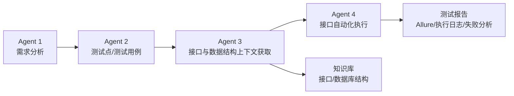
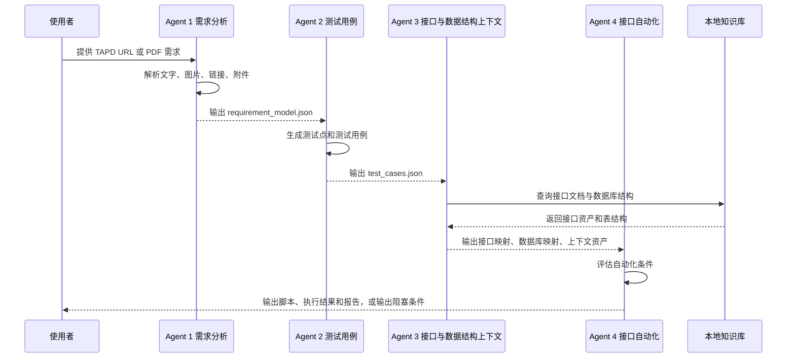

# AI 测试流程 Agent 职责分工与边界说明

## 文件说明
- 文件名称：AI测试流程Agent职责分工与边界说明.md
- 文件作用：系统定义当前 AI 测试流程中各 Agent 的定位、职责、输入、输出、边界和协作关系，用于后续角色规划、流程设计和职责边界确认。
- 文件主要内容：整体架构、4 个 Agent 职责、阶段输入输出、禁止事项、协作规则、目录规范、扩展规则和边界判定原则。
- 所属阶段：流程设计与角色规划阶段。
- 查看方式：直接使用 VS Code、Typora、Markdown Preview 或记事本打开。

## 1. 总体定位
当前 AI 测试流程采用 4 个核心 Agent 协作完成，不建议拆成更多主 Agent。

整体链路为：

```text
需求分析 -> 测试点/测试用例 -> 接口与数据结构上下文获取 -> 自动化执行
```

其中，“接口获取”和“数据库信息获取”不建议拆成两个主 Agent，而是统一归属于 Agent 3：接口与数据结构上下文获取 Agent。

原因是接口和数据库结构本质上都是后续自动化执行所需的上下文资产，二者需要统一做映射、缺失判断和交付。如果拆成两个主 Agent，后续容易出现接口和表结构各说各话、映射重复、职责边界变模糊的问题。

## 1.1 全局强制规则：Agent 职责声明与职责冻结
每个 Agent 在开始执行前，必须先明确声明自己的职责。职责声明是必执行步骤，不能省略。

职责声明必须包含：
- 当前 Agent 名称和角色定位。
- 本阶段允许消费的输入。
- 本阶段必须产出的输出。
- 本阶段不允许做的事情。
- 进入下一阶段的条件。
- 如果条件不满足，必须停在哪个阶段并输出哪些阻塞项。

所有 Agent 必须严格按照本文档定义的职责执行，不能在执行过程中随意扩大、缩小、合并、跳过或更改职责。

严禁行为：
- Agent 1 代替 Agent 2 设计完整测试用例。
- Agent 2 代替 Agent 3 猜接口或数据库表。
- Agent 3 只输出接口路径就交给 Agent 4。
- Agent 3 未获取完整接口契约时把接口标记为可执行。
- Agent 4 跳过 Excel 输入模板、接口契约校验或执行前置检查。
- 任一 Agent 用历史运行数据、默认值、猜测值代替本阶段必须确认的输入。

如果发现当前产物与职责不一致，必须停止继续流转，先输出职责偏差说明和修正计划，再重新执行该 Agent 的缺失职责。

## 2. 当前推荐的 4 个 Agent
| Agent | 推荐名称 | 核心定位 | 是否主 Agent |
|---|---|---|---|
| Agent 1 | 需求分析 Agent | 把 TAPD/PDF 等需求来源解析为结构化、可测试、可追溯的需求模型 | 是 |
| Agent 2 | 测试用例 Agent | 基于结构化需求生成测试点、测试用例和自动化候选判断 | 是 |
| Agent 3 | 接口与数据结构上下文获取 Agent | 获取接口资产、数据库结构、映射关系和缺失项，为自动化提供上下文 | 是 |
| Agent 4 | 接口自动化 Agent | 基于用例、接口、数据库上下文生成和执行接口自动化，并输出报告 | 是 |

## 3. 流程图


## 4. 时序关系


## 5. Agent 1：需求分析 Agent
### 5.1 角色定位
Agent 1 是需求入口 Agent，负责把原始需求转化为后续 Agent 能消费的结构化需求模型。

它是整个流程的事实起点，后续所有测试点、接口映射、数据库映射和自动化判断都必须能追溯到 Agent 1 的输出。

### 5.2 输入范围
- TAPD 需求 URL。
- PDF 需求文档。
- 需求中的图片、流程图、原型图、表格、附件、链接、评论和补充说明。

### 5.3 主要职责
- 获取或解析需求内容。
- 梳理需求名称、背景、业务目标、涉及角色、核心流程和业务规则。
- 识别异常场景、影响范围、验收关注点、风险点和待确认问题。
- 对图片、流程图、原型图和链接内容进行分析，不忽略非正文信息。
- 标记需求中的缺失、冲突、歧义和低置信度内容。
- 输出统一格式的结构化需求模型，供测试用例 Agent 使用。

### 5.4 标准输出
- `requirement_model.json`
- `requirement_analysis.md`
- `pdf_source_snapshot.json`，当输入为 PDF 时生成
- `pdf_extracted_text.md`，当输入为 PDF 时生成
- 页面截图或附件解析结果，当需求来源包含图片或附件时生成

### 5.5 不负责的内容
- 不生成测试用例。
- 不查询接口文档。
- 不查询数据库结构。
- 不生成自动化脚本。
- 不执行测试。
- 不凭空补充需求背景。

### 5.6 进入下一阶段条件
可以进入 Agent 2 的条件：
- 已明确需求目标和核心流程。
- 已输出结构化需求模型。
- 已标记缺失、冲突或待确认问题。
- 即使存在待确认项，也不影响基础测试点设计。

不能进入 Agent 2 的条件：
- 需求文件无法访问或无法解析。
- 需求主体内容为空。
- 无法判断需求目标。
- 图片或附件是核心需求但无法识别，且没有可替代信息。

## 6. Agent 2：测试用例 Agent
### 6.1 角色定位
Agent 2 是测试设计 Agent，负责把结构化需求转化为测试点、测试用例和自动化候选集合。

它不关心接口是否真实存在，也不自行创造接口。它只负责把业务验证意图设计清楚。

### 6.2 输入范围
- Agent 1 输出的 `requirement_model.json`。
- Agent 1 输出的风险点、验收关注点和待确认问题。

### 6.3 主要职责
- 基于需求生成测试点。
- 基于测试点生成测试用例。
- 覆盖主流程、异常流程、边界条件、权限、数据一致性、兼容回归和风险场景。
- 为每条用例标记优先级。
- 标记是否适合接口自动化。
- 建立需求点、测试点和测试用例之间的追溯关系。
- 明确哪些用例需要额外造数、Mock、接口确认或环境支持。

### 6.4 标准输出
- `test_points.json`
- `test_cases.json`
- `test_cases.md`
- `coverage_report.md`，可选

### 6.5 不负责的内容
- 不查询 Apifox。
- 不查询数据库。
- 不编写自动化脚本。
- 不执行接口请求。
- 不假设接口路径、请求方法或字段一定存在。
- 不擅自改变 Agent 1 的需求含义。

### 6.6 进入下一阶段条件
可以进入 Agent 3 的条件：
- 已生成测试点。
- 已生成测试用例。
- 用例具备明确前置条件、步骤和预期结果。
- 用例已标记自动化候选状态。

不能进入 Agent 3 的条件：
- 测试用例无法对应需求点。
- 大量用例没有可验证预期。
- 测试目标不清晰，无法判断需要哪些接口或数据结构。

## 7. Agent 3：接口与数据结构上下文获取 Agent
### 7.1 角色定位
Agent 3 是上下文资产 Agent，不绑定某一个系统，也不是只处理丝路。

它根据本次需求指定的系统范围，获取对应系统的接口信息和数据库结构信息，并建立需求、测试用例、接口、数据库表之间的映射关系。

当前可以处理的系统范围包括：
- 丝路
- 鲨域
- SAAS
- 呼叫中心
- 后续新增系统

每次具体处理哪个系统，由当前需求任务范围决定。例如：
- 本次只处理丝路。
- 本次处理丝路接口和丝路数据库。
- 本次处理鲨域接口和 SAAS 数据库。
- 本次处理多个系统。

### 7.2 为什么接口和数据库属于同一个 Agent
接口和数据库结构都属于自动化执行前的上下文资产。

接口负责告诉自动化 Agent 调哪个接口、怎么调、怎么断言。

数据库结构负责告诉自动化 Agent 数据如何构造、状态如何验证、字段如何追溯。

如果拆成两个主 Agent，会导致：
- 接口映射和表结构映射分裂。
- 同一个测试用例需要重复关联。
- 自动化 Agent 收到两个上下文来源，整合成本变高。
- 缺失项判断容易重复或冲突。

因此推荐统一为 Agent 3，内部再分为三个输出子域：

```text
interface_context_agent/
  output/
    apis/
    database/
    mappings/
```

### 7.3 输入范围
- Agent 1 输出的 `requirement_model.json`。
- Agent 2 输出的 `test_cases.json`。
- 指定系统范围，例如丝路、鲨域、SAAS、呼叫中心。
- 指定接口来源，例如 Apifox 项目、OpenAPI、Swagger、Postman。
- 指定数据库结构知识库。
- 平台凭证读取声明，但不直接接触明文令牌。

### 7.4 主要职责：接口部分
- 根据需求和测试用例识别相关接口。
- 当需求文档、研发报告或附件中已经写出接口，但接口信息不完整时，Agent 3 不能只使用该接口继续流转；必须把文档接口作为显式线索，再结合 Agent 2 输出的测试用例，从知识库中扩展相关候选接口，并通过 Apifox/OpenAPI 获取完整详情。
- 针对每条自动化候选用例，Agent 3 必须围绕测试意图补齐完整接口上下文，包括主测接口、前置准备接口、状态查询或回显验证接口、清理接口、依赖接口和可能影响断言结论的关联接口。
- 文档中已有接口缺少请求头、请求体、响应体、鉴权方式、错误码、字段说明或依赖关系时，必须标记为“不完整接口”，并触发候选接口扩展与详情补齐流程，不能直接交给 Agent 4。
- 以需求业务动作、状态流转、查询回显点、结果验证点和依赖关系为线索，自主反推出完整接口链路，而不是只摘取研发报告、需求文档或附件中显式写出的接口路径。
- 对每个需求至少补齐主写接口、详情或回显接口、列表查询接口、状态变更接口，以及影响测试结论的关键关联接口；如果某类接口无法确认，必须标记为待确认或缺失，不能默认忽略。
- 从指定接口知识库或平台获取真实接口信息。
- 输出接口名称、所属模块、请求方式、请求路径、请求头、Query 参数、Path 参数、请求体、返回体、鉴权方式和接口说明。
- 建立测试用例到接口的映射关系。
- 标记接口缺失、字段缺失、鉴权缺失、文档不完整和低置信度映射。
- 不把外部依赖接口伪装成当前系统接口。

### 7.5 主要职责：数据库部分
- 从指定数据库结构知识库中提取相关表结构。
- 只提取结构信息，不提取业务数据。
- 输出库名、表名、表说明、字段名、字段类型、是否可为空、默认值、主键/索引信息和字段说明。
- 建立需求、测试用例、接口和数据库表之间的映射关系。
- 标记无法确认是否相关的表为“待确认”。
- 标记缺失表、缺失字段、结构不确定和数据来源不明确的问题。

### 7.6 标准输出
接口输出：
- `apis/api_catalog.json`
- `apis/api_catalog.md`
- `apis/silkroad_api_catalog.json`，按系统命名时使用
- `apis/silkroad_api_catalog.md`，按系统命名时使用

数据库输出：
- `database/database_catalog.json`
- `database/database_catalog.md`
- `database/silkroad_database_catalog.json`，按系统命名时使用
- `database/silkroad_database_catalog.md`，按系统命名时使用

映射输出：
- `mappings/endpoint_mapping.json`
- `mappings/interface_context.json`，用于向 Agent 4 交付主接口、前置接口、验证接口、清理接口、依赖接口和缺失说明
- `mappings/database_mapping.json`
- `mappings/database_mapping.md`
- `mappings/missing_interface_report.md`
- `mappings/missing_database_report.md`
- `reports/requirement_testcase_api_database_traceability.md`
- `reports/requirement_testcase_api_database_traceability.json`

### 7.7 不负责的内容
- 不生成测试用例。
- 不修改测试用例意图。
- 不生成自动化脚本。
- 不执行接口请求进行业务测试。
- 不导出业务数据。
- 不把需求文档、研发报告或附件里显式写出的接口当作唯一接口范围。
- 不把缺少请求头、请求体、响应体、鉴权或字段说明的不完整接口直接标记为可交付。
- 不把“研发报告中写到哪些接口”当作接口范围上限。
- 不因为研发报告未显式提到某个关联接口，就省略对详情、列表、回显、状态变更等关联接口的排查。
- 不保存或打印明文令牌、数据库密码。
- 不把未确认接口标记为高置信度。
- 不把未确认表标记为强相关。

### 7.8 进入下一阶段条件
可以进入 Agent 4 的条件：
- 关键测试用例已映射到真实接口。
- 接口请求方式、路径、参数和响应结构足够明确。
- 文档中已有但不完整的接口已完成候选接口扩展、详情补齐或缺失说明。
- Agent 4 所需的主接口、前置接口、验证接口、清理接口和依赖接口已明确，无法确认的部分已进入缺失报告。
- 关键数据构造或验证所需表结构已明确。
- 鉴权方式和环境信息已明确。
- 缺失项不会阻塞自动化生成或执行。

不能进入 Agent 4 的条件：
- 核心接口缺失。
- 核心数据库结构缺失。
- 鉴权方式不清楚。
- 测试数据无法构造。
- 关键字段含义不明确。
- 需求、接口、数据库表之间存在无法解释的冲突。

## 8. Agent 4：接口自动化 Agent
### 8.1 角色定位
Agent 4 是执行闭环 Agent，负责基于上游交付的测试用例、接口资产和数据库结构上下文，生成、执行和报告接口自动化测试。

它是唯一可以生成和执行自动化脚本的 Agent。

### 8.2 输入范围
- Agent 2 输出的 `test_cases.json`。
- Agent 3 输出的接口资产。
- Agent 3 输出的数据库结构上下文。
- Agent 3 输出的映射关系。
- Agent 4 通用 Excel 输入模板：`workspace/templates/Agent4自动化执行输入模板_鉴权约束修正版.xlsx`。
- 测试环境配置。
- 鉴权配置。
- 测试数据构造规则。

### 8.2.1 Agent 4 入口硬规则
到达 Agent 4 时，流程必须先停在“等待用户填写 Excel 输入模板”状态，不允许直接生成脚本、调用接口、修改数据或执行自动化。

Agent 4 的第一步必须是：
- 明确提示用户填写 Agent 4 Excel 输入模板。
- 如果用户直接上传了 Excel 模板文件，Agent 4 不校验文件名，直接按用户上传的文件读取和分析。
- 如果用户没有上传模板，Agent 4 必须自行到统一路径 `workspace/templates/Agent4自动化执行输入模板_鉴权约束修正版.xlsx` 查找通用模板。
- 只有在用户没有上传模板、需要 Agent 4 从统一路径自取模板时，才要求模板名称必须为 `Agent4自动化执行输入模板_鉴权约束修正版.xlsx`。
- 如果统一路径下的模板被改名或不存在，Agent 4 必须提醒用户模板名称或路径不符合规范，并停住等待用户确认或更正。
- 告知用户优先填写 `最小输入` sheet 中的必填单元格。
- 等待用户确认模板已填写。
- 读取并校验 Excel 模板。
- 对账号、密码、token、数据库密码等敏感字段做脱敏展示。
- 只有模板必填项齐全，且环境、鉴权、数据操作权限和执行边界明确后，才允许进入脚本生成或接口执行。

Agent 4 不能把通用模板复制到本次运行目录后要求用户填写副本。用户未上传模板时，应通过统一模板路径获取和维护模板；用户已直接上传模板时，以用户上传的文件为准。

如果 Excel 模板未填写、统一路径模板缺失或被改名、必填项缺失、鉴权不明确、测试数据不可控，Agent 4 必须输出阻塞项清单并停住，不能用默认值、猜测值或历史运行数据代替用户确认。

### 8.3 主要职责
- 评估是否具备自动化生成条件。
- 生成自动化设计方案。
- 生成接口自动化脚本。
- 封装请求、鉴权、断言、数据构造和清理逻辑。
- 执行自动化测试。
- 输出执行日志、失败原因、结果摘要和报告。
- 生成 Allure 报告相关标注，包括 epic、feature、story、title、step、attachment。
- 对失败进行分类：环境问题、接口问题、数据问题、脚本问题、需求/文档问题。

### 8.4 标准输出
- `automation_plan.json`
- `generated_tests/`
- `execution_report.json`
- `failure_summary.md`
- `reports/allure-results/`
- `reports/allure-report/`
- `reports/allure_view_guide.md`

### 8.5 不负责的内容
- 不重新解析需求。
- 不重新设计测试用例。
- 不自行猜测接口路径。
- 不自行猜测数据库表。
- 不绕过 Agent 3 的映射结果。
- 不跳过 Excel 标准输入模板直接生成或执行自动化。
- 不复制一份运行目录内的模板副本来替代统一模板路径。
- 不用历史账号、历史密码、历史环境或历史 token 代替本次用户确认。
- 不在缺少环境、鉴权或关键接口时强行执行。
- 不吞掉执行失败。

### 8.6 自动化执行前置条件
- 用户已填写并确认 Agent 4 Excel 输入模板。
- 已有可访问的测试环境基础地址。
- 已有测试账号或鉴权方式。
- 已有可用接口路径和请求参数。
- 已有可构造或可复用的测试数据。
- 已明确是否允许创建、修改、删除测试数据。
- 已安装或允许安装自动化依赖，例如 `pytest`、`allure-pytest`、Allure CLI。

## 9. 各 Agent 之间的交接契约
| 交接方向 | 上游输出 | 下游消费 | 交接重点 |
|---|---|---|---|
| Agent 1 -> Agent 2 | `requirement_model.json` | 测试点和测试用例设计 | 需求目标、流程、规则、异常、验收点、风险 |
| Agent 2 -> Agent 3 | `test_cases.json` | 接口和数据库结构映射 | 测试意图、前置条件、步骤、预期、自动化候选 |
| Agent 3 -> Agent 4 | 接口资产、数据库结构、映射关系 | 自动化设计、脚本生成和执行 | 接口怎么调、数据怎么造、结果怎么断言 |
| Agent 4 -> 使用者 | 自动化脚本、执行报告、Allure 报告 | 查看、复盘、决策 | 通过失败情况、失败原因、影响范围 |

## 10. 目录规范
每次处理新需求，必须创建独立运行目录：

```text
workspace/runs/<需求标识>/
  requirement_agent/
    input/
    output/
  testcase_agent/
    output/
  interface_context_agent/
    output/
      apis/
      database/
      mappings/
  automation_agent/
    generated_tests/
    output/
  reports/
  record_index.md
```

如果本次任务不进入自动化阶段，可以不生成 `automation_agent` 目录。

## 11. 文件说明规范
所有输出文件必须附带中文说明，至少说明：
- 文件名称。
- 文件作用。
- 文件主要内容。
- 所属阶段。
- 查看方式。

Markdown 文件应在开头包含：

```text
## 文件说明
```

JSON 文件应包含：

```json
{
  "file_info": {
    "file_name": "",
    "file_role": "",
    "main_content": "",
    "stage": "",
    "view_method": ""
  }
}
```

## 12. 系统范围扩展规则
Agent 3 不绑定丝路。它支持按任务范围选择系统。

推荐目录结构：

```text
interface_context_agent/
  output/
    apis/
      silkroad/
      shark/
      saas/
      callcenter/
    database/
      silkroad/
      shark/
      saas/
    mappings/
```

如果本次只处理一个系统，可以使用扁平文件：

```text
apis/silkroad_api_catalog.md
database/silkroad_database_catalog.md
```

如果本次处理多个系统，必须按系统拆分：

```text
apis/silkroad/api_catalog.md
apis/shark/api_catalog.md
database/silkroad/database_catalog.md
database/saas/database_catalog.md
```

## 13. 凭证与安全边界
- 平台令牌、数据库密码、账号密码不允许写入 Prompt。
- 不允许写入代码仓库中的普通配置文件。
- 不允许出现在最终报告、Markdown、JSON 产物或日志中。
- Agent 只声明需要访问哪个平台、哪个系统、获取什么信息。
- 鉴权、令牌读取、令牌轮换由统一凭证管理层和平台接入层负责。
- 数据库阶段只允许读取结构，不允许读取业务数据。

## 14. 职责边界判定原则
当不确定某件事属于哪个 Agent 时，可以按下面规则判断：

| 问题 | 所属 Agent |
|---|---|
| 这是什么需求，业务目标是什么 | Agent 1 |
| 应该测哪些场景 | Agent 2 |
| 这些场景对应哪些接口 | Agent 3 |
| 这些场景涉及哪些表结构 | Agent 3 |
| 能不能自动化 | Agent 4 评估，Agent 3 提供上下文 |
| 自动化脚本怎么写 | Agent 4 |
| 自动化怎么执行和报告 | Agent 4 |
| 接口缺失怎么办 | Agent 3 标记缺失，Agent 4 不强行执行 |
| 表结构不明确怎么办 | Agent 3 标记待确认，Agent 4 不强行造数 |

## 15. 当前推荐结论
当前流程建议保持 4 个主 Agent：

```text
Agent 1：需求分析 Agent
Agent 2：测试用例 Agent
Agent 3：接口与数据结构上下文获取 Agent
Agent 4：接口自动化 Agent
```

其中，Agent 3 负责接口获取和数据库结构获取，但它不是新增 Agent，也不只处理丝路。它是一个可扩展的上下文获取 Agent，按每次任务指定的系统范围处理对应接口和数据库结构。

这套边界可以保证：
- 需求不被测试用例 Agent 改写。
- 测试用例不凭空假设接口。
- 接口和数据库结构统一映射。
- 自动化只基于真实上下文生成。
- 每个阶段都能独立落盘、复盘和追溯。

