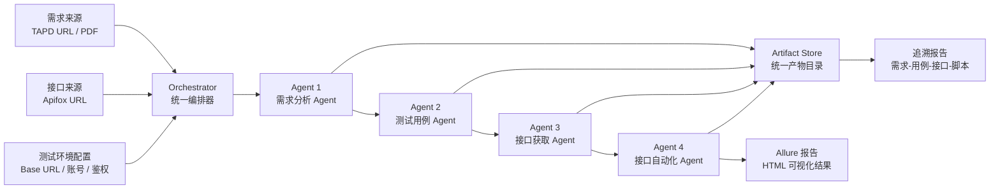
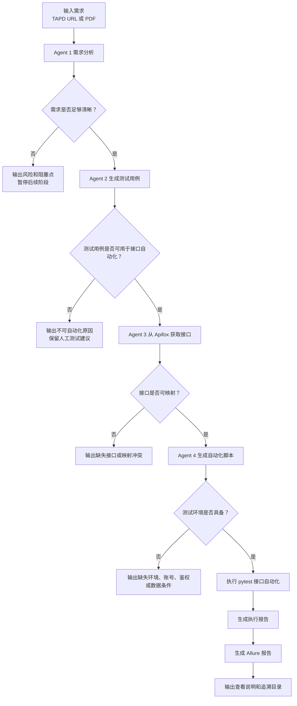
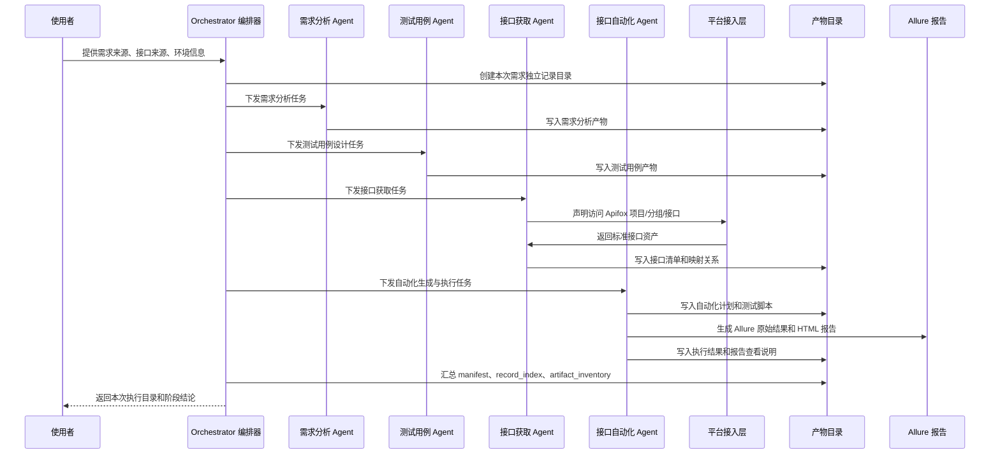

# AI 测试流程建设说明（领导汇报版）

## 文件说明

- 文件名称：`AI测试流程领导汇报说明.md`
- 文件作用：用于向领导说明当前 AI 测试流程的建设目标、整体方案、落地能力、当前验证结果、风险边界和后续规划。
- 文件主要内容：包含项目背景、建设价值、4 个 Agent 分工、端到端流程、产物目录、凭证管理、Allure 报告、当前验证情况、前置条件、风险控制和阶段规划。
- 所属阶段：流程汇总与方案说明阶段。

## 1. 一句话概述

当前项目正在建设一套面向接口测试的 AI 多 Agent 流程，目标是把“需求 → 测试用例 → 接口获取 → 接口自动化 → 报告输出”这条链路工程化、标准化、可追溯化。

它不是单纯让 AI 聊天生成几段测试代码，而是把 AI 能力拆成 4 个高级工程师角色，每个角色有独立职责、独立工作空间、独立产物和执行记录，由统一编排器串联，最终形成可复盘、可审计、可持续演进的测试生产流水线。

## 2. 建设目标

### 2.1 核心目标

通过 AI Agent 和自动化工程能力，把需求文档、接口文档、测试环境和报告系统串起来，实现以下目标：

- 自动解析需求，识别业务目标、流程、规则、异常场景和风险点。
- 自动生成测试点和测试用例，并区分优先级和自动化候选用例。
- 自动从接口平台获取接口资产，目前接口主来源为 Apifox。
- 自动生成接口自动化脚本，并预留 Allure 报告标注能力。
- 自动执行接口测试，输出结构化报告、日志、Allure 报告和追溯关系。
- 每次需求执行都生成独立记录目录，所有结果集中存放、统一命名、可追溯。

### 2.2 最终效果

理想状态下，测试人员只需要提供：

- 需求来源，例如 TAPD URL 或 PDF 需求文档。
- 接口来源，例如 Apifox 项目、分组或接口 URL。
- 测试环境基础地址。
- 可用于自动化执行的账号和数据权限。

系统即可自动完成需求解析、用例生成、接口匹配、脚本生成、执行测试和报告输出。

## 3. 建设价值

### 3.1 对测试效率的价值

- 减少重复性测试设计工作。
- 降低需求到用例、用例到接口脚本之间的人工转换成本。
- 缩短回归测试准备时间。
- 提高接口自动化覆盖效率。

### 3.2 对质量管理的价值

- 每个阶段都有结构化产物，便于评审和复盘。
- 需求、用例、接口、自动化脚本之间建立追溯关系。
- 明确记录缺失信息、阻塞点和风险点，避免隐性质量风险。
- 自动化报告不仅展示通过/失败，还能说明验证了什么需求、覆盖了什么场景、涉及哪些接口。

### 3.3 对团队协作的价值

- 需求、测试、开发、自动化之间通过标准文件交接。
- Agent 职责清晰，便于后续扩展或替换。
- 输出目录统一，减少“结果散落在聊天记录或临时文件里”的问题。
- 后续可以接入更多平台，例如 TAPD、Jira、Swagger、Postman、禅道等。

## 4. 当前整体架构

当前系统采用“1 个编排器 + 4 个 Agent + 统一产物目录 + 统一凭证管理 + Allure 报告”的结构。



## 5. 4 个 Agent 的职责划分

### 5.1 Agent 1：需求分析 Agent

定位：高级需求分析工程师。

职责：

- 读取 TAPD URL 或 PDF 需求文档。
- 提取需求名称、背景、业务目标、涉及角色、核心流程、业务规则、异常场景、影响范围和验收关注点。
- 识别图片、流程图、原型图、链接、附件中的关键信息。
- 标记需求缺失、歧义、冲突和待确认问题。
- 输出结构化需求结果，供后续测试用例 Agent 使用。

主要产物：

- `requirement_model.json`
- `acceptance_criteria.json`
- `business_flow.md`
- `risk_points.json`
- `image_analysis.json`
- `link_analysis.json`
- `attachment_analysis.json`

边界：

- 只负责需求获取和需求分析。
- 不生成测试用例。
- 不获取接口。
- 不生成自动化脚本。

### 5.2 Agent 2：测试用例 Agent

定位：高级测试设计工程师。

职责：

- 基于需求分析结果生成测试点和测试用例。
- 覆盖正向、反向、边界、异常、权限、数据一致性等场景。
- 给用例标记优先级。
- 标记哪些用例适合接口自动化。
- 输出需求覆盖情况，指出未覆盖或无法覆盖的原因。

主要产物：

- `test_cases.json`
- `test_case_matrix.csv`
- `coverage_report.md`

边界：

- 只负责测试设计。
- 不凭空假设接口。
- 不生成自动化脚本。
- 如果需求不完整，需要明确输出风险，而不是强行补全。

### 5.3 Agent 3：接口获取 Agent

定位：高级接口资产分析工程师。

职责：

- 当前接口来源统一为 Apifox。
- 根据用户提供的 Apifox URL 获取项目、分组或接口信息。
- 将接口信息整理为标准接口资产。
- 建立测试用例与接口之间的映射关系。
- 识别接口依赖、鉴权方式、请求参数、响应结构和缺失接口。

主要产物：

- `api_source_request.json`
- `api_source_resolved.json`
- `api_document.json`
- `api_catalog.json`
- `endpoint_mapping.json`
- `request_schema.json`
- `dependency_graph.json`

边界：

- Agent 只声明“要访问哪个平台、获取什么信息”。
- 鉴权和真实平台调用由平台接入层处理。
- 不允许把平台令牌写死在 Prompt、脚本或代码中。
- 不生成测试脚本。

### 5.4 Agent 4：接口自动化 Agent

定位：高级接口自动化工程师。

职责：

- 基于测试用例和接口映射结果评估是否具备自动化条件。
- 生成 pytest 风格接口自动化脚本。
- 自动处理基础环境、登录鉴权、请求构造、响应断言和测试数据。
- 预留 Allure 报告标注能力，包括 epic、feature、story、title、step、attachment。
- 执行测试并输出 execution report、Allure 原始结果和 Allure HTML 报告。

主要产物：

- `automation_plan.json`
- `generated_tests/test_generated_api_cases.py`
- `execution_report.json`
- `allure-results/`
- `allure-report/index.html`
- `allure_report_viewing_guide.md`

边界：

- 如果缺少测试环境、账号、鉴权规则或测试数据权限，需要阻塞并说明原因。
- 不允许在接口信息不足时凭空生成不可验证脚本。
- 报告必须面向最终查看人，而不是只面向开发人员。

## 6. 端到端执行流程



## 7. 阶段时序图



## 8. 每次执行的目录结构

每次处理一个新需求，系统都会创建一个独立记录目录，所有输入、输出、日志、报告统一保存。

示例：

```text
workspace/
  runs/
    <run_id>/
      manifest.json
      record_index.md
      event_log.jsonl
      requirement_agent/
        input/
        output/
        logs/
        state.json
      testcase_agent/
        input/
        output/
        logs/
        state.json
      api_mapper_agent/
        input/
        output/
        logs/
        state.json
      automation_agent/
        input/
        output/
        logs/
        state.json
      reports/
        artifact_inventory.json
        traceability_report.json
        final_summary.md
```

核心规则：

- 每个需求一个独立目录。
- 每个 Agent 一个独立空间。
- 每个阶段都有输入、输出、日志和状态文件。
- 所有文件必须落盘保存。
- 不允许只在对话中输出结果。
- 所有输出文件必须附带中文解释说明，包括文件名称、文件作用、主要内容和所属阶段。

## 9. 统一凭证管理机制

当前系统已经预留统一凭证管理机制，平台令牌不直接写入 Prompt、不写入业务逻辑、不暴露给 Agent。

设计原则：

- Agent 只声明“需要访问哪个平台、获取什么信息”。
- 平台接入层负责读取凭证、完成鉴权和调用。
- 凭证按平台隔离，例如 Apifox、TAPD 后续可分别管理。
- 后续新增其他平台时复用同一套凭证读取机制。
- 本地凭证文件不进入版本库，避免泄露。

当前平台：

- Apifox：用于接口资产获取。
- TAPD：用于需求来源读取，已预留并进行验证。
- PDF：用于直接上传需求文档分析，不依赖平台令牌。

## 10. Allure 报告能力

自动化测试阶段已经按 Allure 报告标准设计。

脚本生成时会预留：

- `epic`：需求或业务域。
- `feature`：功能模块。
- `story`：具体测试场景。
- `title`：测试用例标题。
- `step`：测试步骤。
- `attachment`：请求报文、响应报文、日志等附件。

报告面向最终查看人，而不是只给开发人员排查。

报告需要展示：

- 当前验证的需求是什么。
- 涉及哪些接口。
- 覆盖了哪些测试场景。
- 哪些步骤通过。
- 哪些步骤失败。
- 失败原因是什么。
- 失败影响点是什么。
- 请求和响应证据是什么。

每次生成 `index.html` 后，系统会同步生成 `allure_report_viewing_guide.md`，明确说明：

- `index.html` 的用途。
- 报告所在目录。
- 直接打开方式。
- Python 本地静态服务查看命令。
- Allure CLI 查看命令。

## 11. 当前已经验证的能力

### 11.1 购物车需求完整链路验证

已验证链路：

```text
需求文档 -> 测试用例 -> Apifox 接口获取 -> 接口自动化脚本 -> pytest 执行 -> Allure 报告
```

验证结果：

- 已成功生成 4 个 Agent 的独立工作空间。
- 已成功从 Apifox 获取接口资产。
- 已成功生成 pytest 接口自动化脚本。
- 已成功接入本地测试环境。
- 已成功生成 Allure 报告。
- 自动化执行结果为 `10 passed, 1 skipped, 0 failed`。

代表目录：

```text
workspace/runs/cart-prd-apifox-local-execution/
```

### 11.2 PDF 需求分析 Agent 验证

已验证能力：

- 支持 PDF 作为需求来源。
- 支持图片型 PDF 的页面渲染和截图分析。
- 能输出统一结构的需求分析结果。
- 能识别“需求信息不足，暂不建议进入测试用例阶段”的阻塞点。

代表目录：

```text
workspace/runs/pdf-123-requirement-analysis/
```

### 11.3 TAPD 需求分析 Agent 验证

已验证能力：

- 支持通过 TAPD URL 获取需求内容。
- 支持通过统一凭证机制读取 TAPD 访问令牌。
- 能识别当前子需求正文为空、父需求存在补充内容的场景。
- 能输出需求缺失、图片无法识别、字段规则不完整等风险。

代表目录：

```text
workspace/runs/tapd-1141514785001050792-requirement-analysis/
```

## 12. 当前成熟度判断

当前系统已经具备 MVP 闭环能力。

成熟度可以分为三层：

### 12.1 已经可用

- 4 个 Agent 的职责拆分。
- 独立工作区和阶段状态记录。
- 需求独立记录目录。
- 结构化产物落盘。
- Apifox 接口来源接入。
- pytest 自动化脚本生成。
- Allure 报告生成和查看说明。
- 凭证统一管理机制。

### 12.2 正在增强

- TAPD 需求内容、附件、图片、评论的完整解析能力。
- PDF 图片和流程图的识别精度。
- 接口字段级映射和断言生成能力。
- 测试数据自动准备和回收能力。
- 异常失败的自动归因能力。

### 12.3 后续需要平台化

- Web 页面管理任务和报告。
- 多用户、多项目、多环境管理。
- 任务队列和并发执行。
- 历史趋势分析。
- 权限管理和审计。
- 与公司现有测试管理平台打通。

## 13. 前置条件

要实现稳定、全自动的流程，需要满足以下前置条件。

### 13.1 需求侧条件

- 需求来源明确，只能是 TAPD URL 或 PDF 需求文档。
- 需求内容尽量完整，包括业务规则、异常场景、验收标准。
- 图片、原型图、流程图需要清晰可识别。
- 如果需求涉及外部链接或附件，需要保证可访问。

### 13.2 接口侧条件

- 当前接口来源统一为 Apifox。
- 需要提供 Apifox 项目、分组或接口 URL。
- Apifox 文档需要尽量包含请求参数、响应结构、鉴权方式、接口说明。
- 接口文档需要与实际测试环境保持一致。

### 13.3 环境侧条件

- 测试环境可访问。
- 提供前台、后台或管理端基础地址。
- 提供可脚本化登录的账号。
- 明确登录接口返回 token 的字段和请求头认证格式，或允许系统自动探测。
- 允许自动创建、修改、删除测试数据。
- 允许安装 pytest、allure-pytest、Allure CLI 等执行依赖。

### 13.4 数据侧条件

- 有稳定可用的测试账号。
- 有可造数或可初始化的数据入口。
- 支持数据清理或幂等执行。
- 对库存、上下架、失效、权限等场景，需要有后台接口或管理能力支撑。

## 14. 风险与控制措施

| 风险 | 影响 | 控制措施 |
|---|---|---|
| 需求描述不完整 | 用例生成不完整，自动化覆盖不足 | 需求分析阶段输出待确认问题和阻塞点 |
| 图片或 PDF 不清晰 | 关键字段或流程识别不准确 | 保留页面截图和图片分析文件，要求人工补充清晰资料 |
| 接口文档与实际环境不一致 | 自动化脚本执行失败 | 接口获取阶段保留接口来源快照，自动化阶段输出失败原因 |
| 鉴权规则复杂 | 脚本无法稳定登录或调用接口 | 统一凭证管理，登录逻辑工程化封装 |
| 测试数据不可控 | 自动化无法重复执行 | 增加造数、清理、幂等执行和数据隔离机制 |
| AI 生成内容存在幻觉 | 结果可信度下降 | 通过 Schema、产物落盘、质量门禁和阶段阻塞控制 |
| 报告只能给技术人员看 | 管理层难以判断质量状态 | Allure 报告按需求、场景、步骤、证据组织展示 |

## 15. 为什么不让 4 个 Agent 自由聊天

当前方案不采用 4 个 Agent 自由对话，而采用编排器控制的流水线模式。

原因：

- 测试流程需要稳定，不适合完全自由协作。
- 每个阶段必须有标准输入和标准输出。
- 出错时需要能定位是哪个阶段的问题。
- 结果必须可审计、可复盘、可重跑。
- 领导和团队更关心确定性结果，而不是 Agent 的聊天过程。

因此当前设计是：

```text
Orchestrator 控制流程
Agent 负责专业处理
Artifact Store 保存结果
Quality Gate 决定是否进入下一阶段
```

## 16. 后续演进规划

### 阶段一：MVP 闭环

目标：把单需求链路跑通。

范围：

- TAPD/PDF 需求分析。
- Apifox 接口获取。
- 测试用例生成。
- pytest 自动化脚本生成。
- Allure 报告输出。
- 独立记录目录和追溯文件。

当前状态：基本已具备。

### 阶段二：增强稳定性

目标：让流程从“能跑通”升级为“可稳定复用”。

重点：

- 强化 PDF 和图片解析。
- 强化 TAPD 附件、评论、链接解析。
- 强化接口字段映射。
- 增加自动造数和数据清理。
- 增加失败归因。
- 增加阶段重试和断点续跑。

### 阶段三：平台化

目标：把能力做成团队可用的平台。

重点：

- Web 管理页面。
- 多项目、多环境、多账号管理。
- 任务队列。
- 报告中心。
- 历史趋势分析。
- 权限和审计。
- 与测试管理系统集成。

## 17. 对领导的结论建议

当前方向具备落地价值，建议继续推进。

理由：

- 当前已经不是纯概念方案，已经有可运行的 MVP 工程骨架。
- 4 个 Agent 分工明确，职责边界清晰。
- 已经通过购物车需求验证过完整链路。
- 已经支持 Apifox、PDF，并预留 TAPD。
- 已经具备 Allure 报告展示能力。
- 已经建立“每个需求独立目录、所有产物落盘、所有文件中文说明”的追溯机制。

建议下一步投入重点：

1. 固化 TAPD 需求读取能力。
2. 固化 Apifox 接口获取能力。
3. 选择 2 到 3 个真实业务需求做试点。
4. 建立需求质量、接口质量、自动化可执行性的准入标准。
5. 补齐测试数据自动准备和清理能力。
6. 将报告输出标准化为可直接汇报的质量报告。

## 18. 管理层可关注的判断指标

后续可以用以下指标判断项目成效：

- 单个需求从输入到用例产出的耗时。
- 单个需求从用例到接口自动化脚本产出的耗时。
- AI 生成用例的人工修改率。
- 接口映射成功率。
- 自动化脚本可执行率。
- Allure 报告可读性和复盘效率。
- 缺陷发现率。
- 回归测试节省时间。
- 需求、用例、接口、脚本追溯完整率。

## 19. 总结

这套 AI 测试流程的核心价值不是“让 AI 替代测试人员”，而是把测试人员大量重复、机械、格式转换类的工作交给 Agent，把人的精力释放到需求判断、风险分析、质量决策和复杂场景设计上。

当前方案的正确建设路径是：

```text
先跑通闭环
再提升稳定性
再扩展平台化
最后形成团队级质量工程能力
```

从当前验证结果看，这条路线具备实现基础，可以继续作为 AI 测试工程化方向推进。
