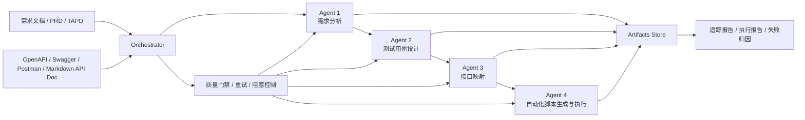
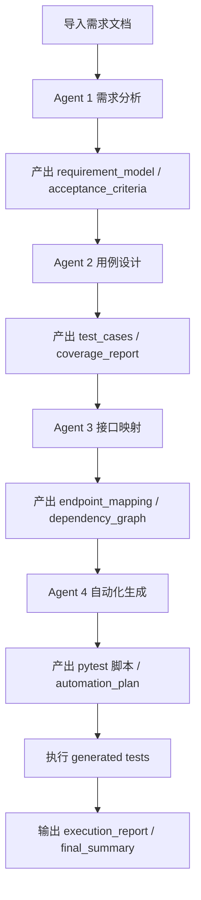
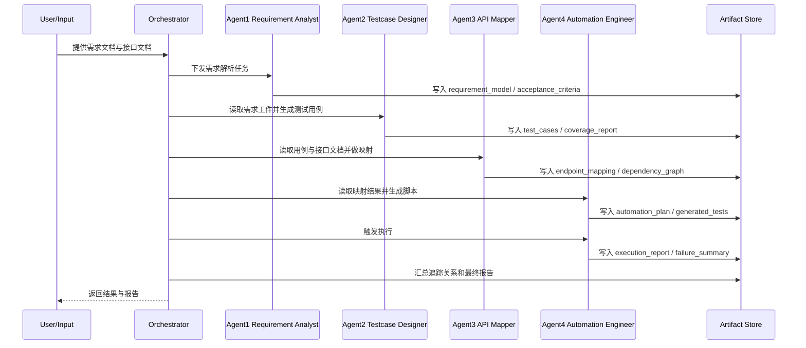

# AI 多 Agent 接口测试流水线设计方案

## 1. 目标定义

我们要建设的不是“4 个 AI 聊天协作”的松散系统，而是一套**文档驱动、可追踪、可重试、可扩展**的接口测试流水线。

目标链路如下：

`需求文档 -> 测试用例 -> 接口识别/映射 -> 接口自动化脚本 -> 自动执行 -> 报告与追踪`

最终目标：

- 输入需求文档和接口文档。
- 系统自动完成需求结构化、测试用例设计、接口映射、脚本生成、执行与报告输出。
- 全程通过编排器驱动，4 个专职 Agent 各司其职。
- 每个阶段都产出标准化工件，便于审计、回放、重试和后续增强。

## 2. 你这件事更准确的定义

把你的原始表述丰富以后，更适合落地的定义是：

> 搭建一套面向接口测试的 AI 多 Agent 工厂。系统基于需求文档和接口文档，自动生成结构化测试工件和可执行的接口自动化脚本，并在测试环境中执行，最终输出带有需求-用例-接口-脚本追踪关系的结果报告。

一句话概括：

> 输入文档，输出接口自动化与测试报告，中间不依赖人工接力。

## 3. 可实现性评估

这个方案是**可以落地**的，而且在测试平台、质量工程、回归提效三个方向上都很有价值。

### 3.1 可实现程度

- 在需求模板稳定、接口文档规范的情况下，可实现性约为 `70%~85%`
- 在需求模糊、接口文档漂移较大的情况下，可实现性约为 `40%~60%`
- 想做到接近 `100% 无人工介入`，前提是测试环境、鉴权、测试数据准备都已经工程化

### 3.2 最适合的使用场景

- 需求文档具有固定结构
- 接口文档来自 OpenAPI / Swagger / Postman / 规范 Markdown
- 接口环境稳定可调用
- 账号、Token、签名、测试数据创建已经可脚本化

### 3.3 最容易失败的地方

- 需求描述本身不清楚，存在冲突或遗漏
- 接口文档与真实服务不一致
- 接口依赖复杂状态或外部上下游
- 测试数据仍然依赖人工准备
- AI 在字段映射和断言生成上产生幻觉

### 3.4 结论

- 这件事值得做
- 第一版必须优先做成**文档驱动的闭环 MVP**
- 不建议第一天就追求“完全自治”
- 正确路径是：`结构化工件 -> 编排器控制 -> 可执行脚本 -> 可验证报告`

## 4. 总体设计思路

推荐方案：

- `1 个 Orchestrator`
- `4 个专职 Agent`
- `1 套共享工件存储`
- `1 套质量门禁`

不推荐一开始就让 4 个 Agent 自由对话式协作。因为测试场景更需要：

- 稳定
- 可解释
- 可回放
- 可定位失败原因
- 可按阶段重试

### 4.1 推荐架构



### 4.2 为什么选这种方案

优点：

- 比自由协作型多 Agent 更稳
- 每个 Agent 的职责边界清晰
- 每个阶段都有标准输入输出
- 更容易替换模型、替换 Prompt、增加规则引擎
- 方便后期加入 UI、任务调度、报告中心

缺点：

- 灵活性比完全自治网络稍弱
- 第一版需要先把工件格式定义清楚

结论：

- 对你的目标来说，这是最适合从 0 到 1 落地的路线

## 5. 4 个 Agent 角色设计

### 5.1 Agent 1：需求分析师

角色目标：

- 把原始需求文本转成“可测试、可追踪、可结构化”的需求模型

输入：

- PRD
- TAPD/Jira story
- Markdown 需求文档
- 业务说明文档

输出：

- `requirement_model.json`
- `acceptance_criteria.json`
- `business_flow.md`
- `risk_points.json`

职责：

- 提取业务目标与场景
- 拆分主流程、分支流程、异常流程
- 提炼前置条件、输入规则、输出规则、状态变化
- 把模糊表达重写为可验证验收标准
- 标记不明确和低置信度项

Prompt 设定重点：

- 你是高级测试需求分析专家
- 你的任务是把业务需求转成结构化测试需求
- 你不能产出自动化脚本
- 你必须输出标准化工件

### 5.2 Agent 2：测试用例设计师

角色目标：

- 把结构化需求转成接口测试维度的测试用例

输入：

- Agent 1 产物

输出：

- `test_cases.json`
- `test_case_matrix.csv`
- `coverage_report.md`

职责：

- 生成正向、反向、边界、异常、权限、幂等、数据校验类用例
- 增加前置条件、步骤、预期结果、优先级、标签
- 建立用例和需求 ID 的追踪关系
- 输出覆盖率视图，说明覆盖了哪些规则、哪些还没覆盖

Prompt 设定重点：

- 你是接口测试设计专家
- 你只负责产出“可自动化的测试用例”
- 你先不猜接口
- 你关注测试意图与校验点

### 5.3 Agent 3：接口契约映射师

角色目标：

- 把测试意图映射到真实接口定义

输入：

- Agent 1 产物
- Agent 2 产物
- OpenAPI / Swagger / Postman / Markdown API 文档

输出：

- `api_catalog.json`
- `endpoint_mapping.json`
- `request_schema.json`
- `dependency_graph.json`

职责：

- 解析接口文档
- 建立“测试用例 -> 接口路径/方法/参数/鉴权”的映射
- 识别接口依赖关系和调用顺序
- 标记缺失接口、文档歧义和低置信度映射

Prompt 设定重点：

- 你是 API 契约分析与映射专家
- 你的工作是建立“业务测试意图”和“真实接口定义”的桥梁
- 在映射完成前不允许生成自动化代码

### 5.4 Agent 4：接口自动化工程师

角色目标：

- 根据用例和接口映射结果生成可执行接口自动化脚本，并尝试执行

输入：

- Agent 2 产物
- Agent 3 产物
- 环境配置
- 鉴权配置

输出：

- 自动化脚本
- 测试夹具
- 执行报告
- 失败摘要
- 追踪报告

职责：

- 生成可维护的 pytest 风格接口测试脚本
- 复用通用 client、鉴权、断言能力
- 支持 `dry-run`、`generate-only`、`execute` 三种模式
- 执行测试并产出结果

Prompt 设定重点：

- 你是高级接口自动化工程师
- 你的工作是产出可维护、可执行、可复用的接口测试代码
- 你要优先抽象通用层，而不是生成一次性脚本

## 6. 编排器设计

编排器不是 4 个业务 Agent 之一，而是系统的大脑。

### 6.1 编排器职责

- 接收任务输入
- 组织阶段执行顺序
- 传递标准化工件
- 控制质量门禁
- 管理重试
- 管理失败阻塞
- 汇总结果并输出最终报告

### 6.2 为什么 Agent 之间不要直接聊天

推荐通信规则：

- Agent 不直接互相对话
- 所有阶段只读“上游结构化工件”
- 所有产出统一回写到 artifact store

原因：

- 噪音更少
- 结果更确定
- 更容易定位问题
- 重试时只需重跑某一阶段

## 7. 核心工件设计

这套系统真正的核心不是 Prompt，而是**工件链路**。

推荐的追踪链：

`REQ-001 -> TC-001 -> API-USER-CREATE -> AUTO-CASE-001`

### 7.1 工件清单

```text
requirements/
  requirement_model.json
  acceptance_criteria.json
  business_flow.md
  risk_points.json

testcases/
  test_cases.json
  test_case_matrix.csv
  coverage_report.md

api_mapping/
  api_catalog.json
  endpoint_mapping.json
  request_schema.json
  dependency_graph.json

automation/
  automation_plan.json
  generated_tests/
  execution_report.json
  failure_summary.md

reports/
  traceability_report.json
  final_summary.md
```

### 7.2 MVP 项目目录结构

```text
Test_AI_Agent/
  docs/
    superpowers/
      specs/
      plans/
  examples/
    requirements/
    apis/
  prompts/
    requirement_analyst.md
    testcase_designer.md
    api_mapper.md
    automation_engineer.md
  schemas/
    requirement_model.schema.json
    test_cases.schema.json
    endpoint_mapping.schema.json
    automation_plan.schema.json
    execution_report.schema.json
  src/
    ai_pipeline/
      __init__.py
      cli.py
      config.py
      contracts.py
      artifact_store.py
      orchestrator.py
      schema_registry.py
      prompt_registry.py
      openapi_loader.py
      agents/
        __init__.py
        requirement_agent.py
        testcase_agent.py
        api_mapper_agent.py
        automation_agent.py
  tests/
    conftest.py
    test_pipeline_demo.py
    test_schema_registry.py
    test_prompt_registry.py
  pyproject.toml
  README.md
```

## 8. 质量门禁设计

每个阶段都应该有质量门禁，而不是只靠模型“感觉对”。

### 8.1 建议门禁

- Gate 1：需求完整度
- Gate 2：测试覆盖率
- Gate 3：接口映射置信度
- Gate 4：脚本生成完整度
- Gate 5：执行结果分类

### 8.2 门禁失败后的处理

- 轻度失败：补充 Prompt 重试
- 中度失败：降级生成低置信度结果并打标
- 严重失败：阻塞流水线并输出阻塞原因

## 9. 技术方案建议

### 9.1 MVP 推荐技术栈

- `Python 3.12`
- `pytest`
- `urllib.request` 或 `httpx`
- `JSON Schema`
- `自定义状态机 Orchestrator`

### 9.2 为什么 MVP 不建议一开始就上重型框架

原因：

- 你现在最需要的是先跑通一条闭环
- 自定义状态机更容易控制和调试
- 后续如果规模扩大，再引入 LangGraph、Celery、FastAPI 都不晚

### 9.3 后续增强栈

第二阶段可以逐步加入：

- `FastAPI`
- `LangGraph`
- `Redis`
- `PostgreSQL`
- `Allure`
- `真正的 LLM Provider 接入`

## 10. 前置条件

想做到真正的全自动，至少要满足下面这些前置条件。

### 10.1 文档前提

- 需求文档有稳定模板
- 每条需求有唯一 ID
- 接口文档尽量规范，最好是 OpenAPI/Swagger
- 验收标准可以清晰表达

### 10.2 环境前提

- 稳定可访问的测试环境
- 可用的 base URL
- 可脚本化的账号与 Token 获取机制
- 可回收或可初始化的测试数据
- 安全的密钥管理方式

### 10.3 工程前提

- 代码仓库
- 任务运行目录
- 报告存储位置
- 日志与追踪机制
- 重试与超时控制机制

### 10.4 治理前提

- Prompt 版本管理
- 工件版本管理
- 执行审计日志
- 人工兜底开关

说明：

- 你说“全程不需要手工操作”是目标
- 但系统仍然必须保留“可观察、可中断、可回滚”的能力

## 11. 主流程说明

### 11.1 主流程图



### 11.2 时序图



## 12. 分阶段落地路线

### Phase 1：MVP

目标：

- 支持需求文档输入
- 支持 OpenAPI/JSON 示例输入
- 产出结构化测试工件
- 生成 pytest 风格接口脚本
- 在未配置环境时支持 `skip` 执行
- 输出执行报告和追踪报告

### Phase 2：增强版

增强项：

- 更强的字段级映射
- 更好的覆盖率分析
- 测试数据自动准备
- 失败自动分类
- 任务队列和异步执行

### Phase 3：高级版

增强项：

- 后端代码扫描补全接口
- API 漂移检测
- Prompt 自反思与重试优化
- 回归影响面分析

## 13. 风险与控制

主要风险：

- 文档质量差
- 文档和真实接口不一致
- 复杂鉴权难以自动生成
- 测试环境不稳定
- 生成的断言和字段映射存在幻觉

控制策略：

- 先规则后模型
- 每阶段输出置信度
- 保留全部中间工件
- 用 Schema 和结构约束模型输出
- 执行层严格区分 `generate-only` 和 `execute`

## 14. 结论与下一步

你的方向是对的，而且很适合做成一个长期可扩展的平台型能力。

最重要的不是“4 个 Agent 同时工作”，而是：

- 角色边界清晰
- 工件结构稳定
- 编排器可控
- 执行可验证

下一步最合理的动作就是：

1. 按上述目录结构搭 MVP 工程骨架
2. 落地 JSON Schema
3. 固化 4 个 Agent Prompt 模板
4. 实现一个可跑通的 Orchestrator Demo
5. 用样例文档跑出第一份工件与脚本

这也是我接下来要帮你完成的部分。
